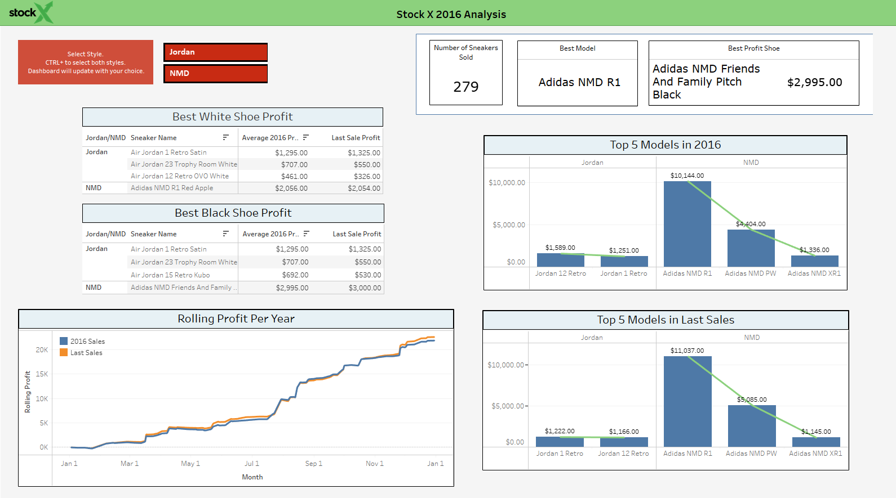
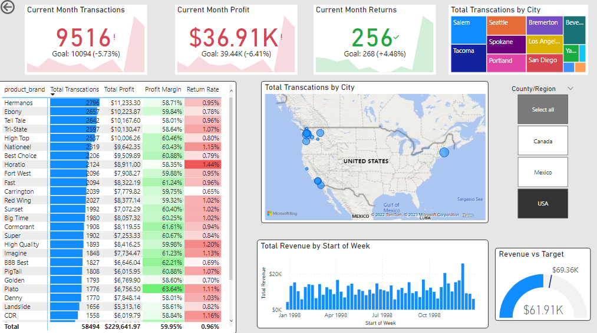
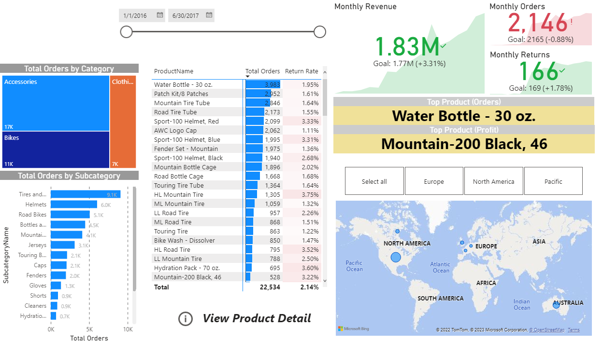
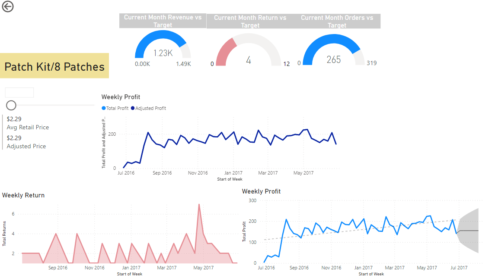
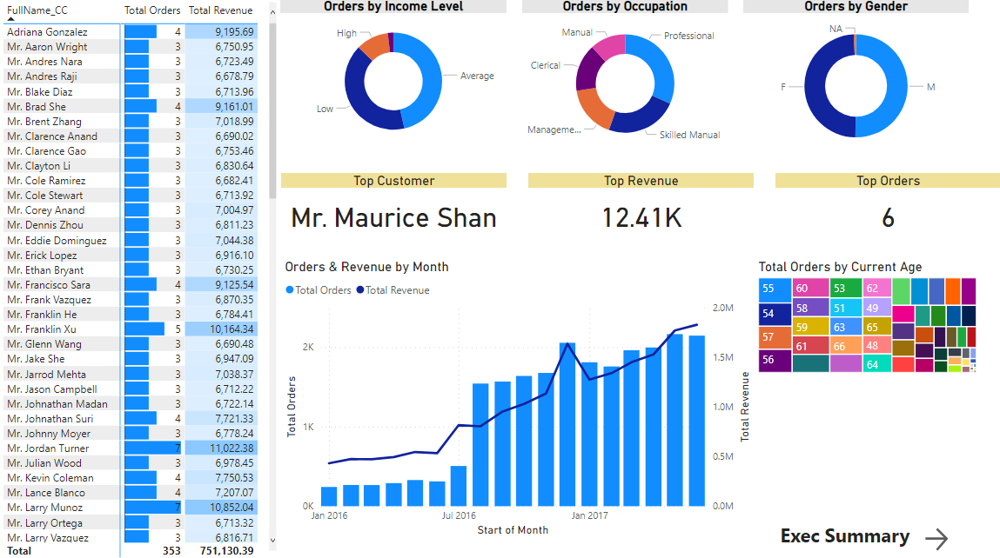

# Mario_Portfolio
Mario Reyes' Data Analytics portfolio.

# [Project 1L 2023 Movie Industry Data](https://github.com/marioreyes5/Mario_Portfolio/blob/0145490a1f9d725b560e381249949e891dc695b6/Movie%20Correlation%20Project.ipynb)
Data analysis project that looked at over 3000+ movies released from 1980-2020. The goal was to figure out is there were any correlations between a movie's characteristics and their gross revenue. Data was obtained from [Kaggle](https://www.kaggle.com/datasets/mohammadrizwansajjad/top-200-movies-of-2023) which scraped from IMDb's website.

The data was imported to Jupyterlab and utilized the coding language of Python to generate metrics. Within python we cleaned up the data and visualized it. Some of the libraries used were pandas, numpy, matplot, and seaborn.

  

  
# [Project 1: 2017 StockX Sales Data](https://public.tableau.com/shared/ZZX3ZSD2X?:display_count=n&:origin=viz_share_link)
In 2016 StockX, an online retailer platform, hosted a data contest giving people the opportunity to use current sales data to identify trends in the market. [The StockX Contest](https://stockx.com/news/data-contest-analyze-jordans-nmds-win-money/) supplied us with a snippet of Nike and Adidas shoe sales in 2016 consisting of only US sales. 

The data was imported into [SQL](https://github.com/marioreyes5/Mario_Portfolio/blob/main/StockX2016_SQLQuery.sql) for clean up, modification, and analysis. Then, data from the queries was exported to cvs files and linked to tableau desktop. Visualization building took place in tableau desktop which includes a filter to view statistcs between both shoe brands. The final dashboard was uploaded to tableau public.

  

# [Project 2: Worldwide Happiness Analysis](https://github.com/marioreyes5/Mario_Portfolio/blob/main/PowerBI/Happiness.pbix)
The World Happiness Report is a document that reports the status of global happiness within Countries. It uses data from the annual Gallup World Poll distributed throughtout the years. An extract of the 2015-2019 data was obtained from [Kaggle](https://www.kaggle.com/datasets/unsdsn/world-happiness) and analyzed to identify KPIs, trends, and relationships. 

The data was merged, cleaned up, and connected to start the process of cross analysis. Measures and columns were created using DAX and Power Query. This enabled us to dive deeper into analytics as data relationships were now created. The final PowerBI dashboard was uploaded to this Portfolio. 

 

  

# [Project 3: 2019 StockX Sales Data](https://public.tableau.com/app/profile/mario.reyes5171/viz/StockX_2019_Analysis/Dashboard1)
In 2019 StockX, an online retailer platform, hosted a data contest giving people the opportunity to use current sales data to identify trends in the market. [The StockX Contest](https://stockx.com/news/the-2019-data-contest/) supplied us with a snippet of shoe sales from between 9/1/2017 to 2/13/2019 consisting of US sales. 

The data was imported into [SQL](https://github.com/marioreyes5/Mario_Portfolio/blob/main/StockX_SQLQuery.sql) for clean up, modification, and analysis. Then, data from the queries was exported to cvs files and linked to tableau desktop. Visualization building took place in tableau desktop and finally uploaded to tableau public.

  

# [Project 4: Nationwide Covid-19 Statistics](https://public.tableau.com/app/profile/mario.reyes5171/viz/NationwideCovid-19Statisticsasof2113/Dashboard1?publish=yes)
A Covid-19 nationwide analysis on continents and their countries. Data was outsoured from the [OurWorldinData](https://ourworldindata.org/covid-deaths) website which compiled population, infection, vaccination, and death information from February 4, 2020 to January 31, 2023. 

[SQL queries](https://github.com/marioreyes5/Mario_Portfolio/blob/main/Covid19_SQLQuery.sql) were written to explore the information in the data sets. Once the analysis was completed, the most compelling findings were identified and exported to excel sheets to upload into Tableau. Metric visualizations were created using Tableau Desktop, grouped together in a dashboard, and uploaded to Tableau Public
 
  
 

  

# [Project 5: Sales Metrics Visualization With Power BI](https://github.com/marioreyes5/Mario_Portfolio/blob/main/PowerBI/MavenMarket.pbix)
In this project I looked at the sales of 100+ stores scattered throughout multiple continents to determine the total revenue per product, along with monthly KPI to determine business performance. Power Query and DAX language was used to create the necessary metrics for the visualization, also helping to clean up the data, and establishing clear relationships between tables.

  

# [Project 6: Business Metrics Visualization With Power BI](https://github.com/marioreyes5/Mario_Portfolio/blob/main/PowerBI/AdventureWorks_ReportV2.pbix)
* Created a Power BI dashboard illustrating the $7.8M profit distribution of a bike shop operating for 2 years.
* Utilized DAX and M language to create measures and calculated columns.
* Cleaned up multiple data sources and created relationships to further develop analysis.
* Implemented a drill through option to examine a product's profit and return rate.
* Developed insights of customer demographics to guide business decisions.
  
 

  
  
  

